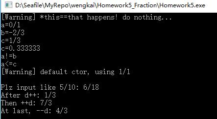

#Homework5 Fraction

## ScreenShoot



## 题目要求

> Write a class presents a fraction number like 2/3.

> Functions below have to be implemented for this class:

> * default ctor

> * ctor takes two integers as parameters

>* copy ctor

> * arithmetical operators: + - * /

> * relational operators: < <= == != >= >

> * type cast to double

> * toString

> * inserter and extractor for streams

简单的说，要设计一个Fraction类完成各种操作符重载

## 类的设计 Fraction.h

```
class Fraction{
private:
    int a;//分子
    int b;//分母 
    void yuefen();//执行约分，构造函数和inserter需要调用 
public:
    //构造函数，赋值运算符重载
    Fraction();
    Fraction(int ia,int ib);
    Fraction& operator=(const Fraction& that); 
    Fraction(const Fraction& that);
    virtual ~Fraction();//析构函数
    //操作运算符 + += - -= * *= / /=
    const Fraction operator+(const Fraction& that) const;
    Fraction& operator+=(const Fraction& that);
    const Fraction operator-(const Fraction& that) const;
    Fraction& operator-=(const Fraction& that);
    const Fraction operator*(const Fraction& that) const;
    Fraction& operator*=(const Fraction& that);
    const Fraction operator/(const Fraction& that) const;
    Fraction& operator/=(const Fraction& that);
    //比较运算符 < <= == != >= >
    bool operator<(const Fraction& that) const;
    bool operator>=(const Fraction& that) const;
    bool operator>(const Fraction& that) const;
    bool operator<=(const Fraction& that) const;
    bool operator==(const Fraction& that);
    bool operator!=(const Fraction& that);
    //类型转换
    operator double();
    string toString();
    //输入输出流
    void show() const;
    friend ostream& operator<<(ostream& os,const Fraction& obj);
    friend istream& operator>>(istream& is,Fraction& obj);
    //++ --
    const Fraction& operator++();
    const Fraction operator++(int);
    const Fraction& operator--();
    const Fraction operator--(int);
};
```

----

#一点心得：

1. 计算公因数要考虑负数的情况

2. const在各处的含义要明确，如

    const Fraction operator/(const Fraction& that) const
    
    这一句中第一个const 表示除法返回的运算值不能做左值

    第二个const 表示我这个除法函数不会对第二个参数做修改

    第三个const 表示我这个函数对自己也不会修改

3. inserter 的函数，怎么把 3/15 中间的/干掉？

    查阅cin的用法，发现有个get()方法可以从输入流得到一个字符

    所以用is.get()就干掉了中间的/咯~

4. 要重载>>与<<，是不能写成类的成员函数的

    因为操作对象是istream和ostream，并不是我们写的类

    要在全局中写一个`ostream& operator<<(ostream& os,const Fraction& obj)`

    并且在类的定义中把这个函数声明加个friend