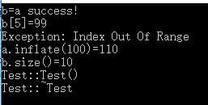

#Homework6 Vector

## ScreenShoot



## 题目要求

Given the declaration of class template Vetor below, write the bodies of the functions, and a main() to test all the facilities Vector provides.

```
class IndexOutofBounds {};

template <class T>
class Vector {
public:
	Vector();		// create an empty vector
	Vector(int size);	// create a vector of size elements
	Vector(const Vector& r);	// copy ctor
	virtual ~Vector();
	T& operator[](int index) : throw(IndexOutofBounds);
		// return the specified element, throws exception when index <0 or >=m_nSize
	int size();		// return the size of the vector
	int inflate(int addSize);	// expand the storage to m_nSize+addSize, return the new size
private:
	T *m_pElements;
	int m_nSize;
};

```

简单的说，写一个模板类并测试就好了

具体有抛出IndexOutofBounds的要求

----

#一点心得：

## 1. 每写一个函数定义都要写上template

```
template <class T>
int Vector<T>::inflate(int addSize)
```

## 2. 模板类中的函数不能是virtual的

    解释如下，来自http://stackoverflow.com/questions/28009476/error-templates-may-not-be-virtual

> Member function templates cannot be virtual. If this was allowed then the linker would have to add a new entry to the virtual table every time the Format function was called with a different type. Dynamic linking would be unacceptably complicated.

## 3. 要写拷贝构造，不如写operator=的重载再调用*this=that